<div align="center">

# TeleDrive

### A home for your files. A gallery for your memories.

Organize, browse, back up, and share a personal drive backed by Telegram.

**Flutter · Android · iOS · Direct TDLib transfers**

[Explore the app](#explore-the-app) · [Get started](#get-started) · [Configuration](#configuration) · [Architecture](#architecture) · [Developer guides](#developer-guides)


</div>

TeleDrive brings files, photos, folders, and shared links into one mobile library. Pick up a recent document, browse a photo collection, star a folder you return to often, or send someone a link from the same app.

This repository contains the **Flutter mobile client for Android and iOS**. The app talks to a separate TeleDrive backend for account and library metadata. Supported personal-file uploads and downloads run on the device through Telegram's TDLib integration.

Android uses Material conventions. iOS has Cupertino layouts and native UIKit bridges for supported navigation and item interactions. Both share the same data and action logic.

> **About the images:** the paper illustrations are AI-generated editorial artwork. App screens are existing Flutter-rendered fixtures with sample content, portable fonts, and fallback native controls. They show representative layouts, not live accounts or photographs of physical devices; native UIKit appearance can differ. Paired screens follow your browser's light/dark preference where supported. [Image provenance and prompts](docs/assets/readme/provenance.json).

## Explore the app

| Start here | What you can do | Where it leads |
| --- | --- | --- |
| **Drive** | Search files and folders, revisit recents, organize collections | A library arranged around everyday use |
| **Photos** | Browse date-grouped media and filter photos or videos | A focused view of your visual library |
| **Starred** | Keep useful files and folders close | A shorter route back to important items |
| **Shared** | Find links, inspect access details, copy or revoke a share | A place to manage what you have shared |
| **Account** | Switch saved accounts, manage backup, inspect storage | Controls that stay tied to the active account |
| **Settings** | Adjust upload rules, cache, privacy, notifications and appearance | Behavior suited to your device and connection |

### Drive: start with what you need

Search sits above Archive, Locked, and Trash, followed by recent files, folders, and the rest of your files. Open a folder to narrow the view, or switch between supported list and grid layouts from the menu.

<table>
<tr><th align="center" width="50%">Android</th><th align="center" width="50%">iOS</th></tr>
<tr><td align="center"><picture><source media="(prefers-color-scheme: dark)" srcset="docs/assets/readme/drive-android-dark.webp">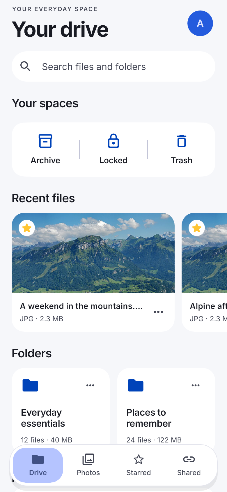</picture></td><td align="center"><picture><source media="(prefers-color-scheme: dark)" srcset="docs/assets/readme/drive-ios-dark.webp">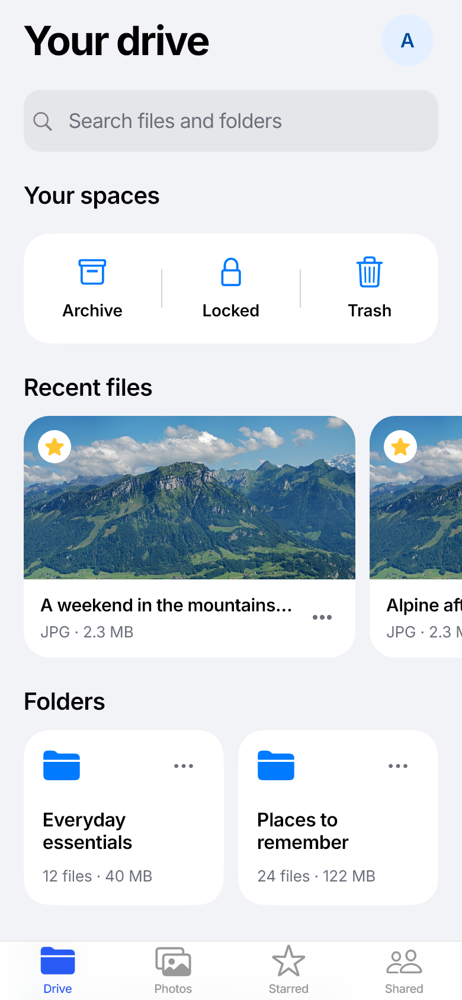</picture></td></tr>
<tr><td>Material controls, a floating navigation surface, and familiar file actions.</td><td>Cupertino hierarchy and grouped spaces. This fixture uses the Flutter navigation fallback.</td></tr>
</table>

**Try it:** create a folder for a trip, add your documents and photos, then star the folder. Search for a filename when you need one item; open the folder when you want the whole collection. Submitting search dismisses the keyboard while retaining your query.

<p align="center"></p>

**Organize without losing your place.** File and folder actions include renaming, moving, starring, sharing, and the applicable archive, lock, or trash actions. Selection gathers eligible loaded items for batch operations.

**Give each space a purpose.** Archive keeps less-used material out of the main view. Locked is a separate library shelf; its name is not a claim of end-to-end file encryption. Trash provides the supported restore and deletion workflow.

**Keep familiar controls.** On supported iOS builds, press and hold to open native item menus. Supported content can appear in a preview; unavailable or unsupported content falls back to a file summary and Open action. Android keeps its Material interaction patterns.

### Photos: browse the day, then the detail

The Photos tab gathers images and videos into a date-based library. Use All media, Photos, or Videos to narrow the view, search within your media, and open an item for closer inspection.

<table>
<tr><th align="center" width="50%">Android</th><th align="center" width="50%">iOS</th></tr>
<tr><td align="center"><picture><source media="(prefers-color-scheme: dark)" srcset="docs/assets/readme/photos-android-dark.webp">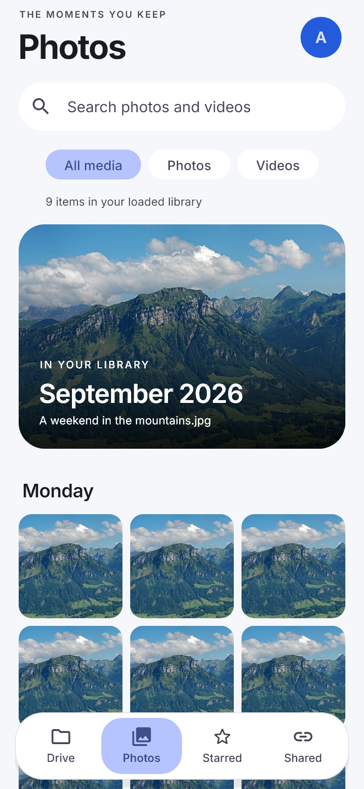</picture></td><td align="center"><picture><source media="(prefers-color-scheme: dark)" srcset="docs/assets/readme/photos-ios-dark.webp">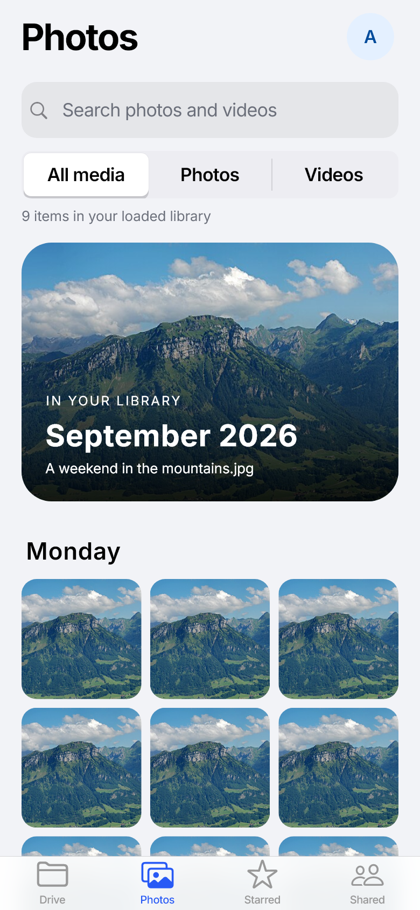</picture></td></tr>
<tr><td>A visual library with Material filters and shared media-viewing actions.</td><td>A quieter gallery with Cupertino filters and platform-specific viewer controls.</td></tr>
</table>

<p align="center"></p>

**From overview to original.** Thumbnails help you browse before opening a full file. The media loader prioritizes visible items, shares duplicate requests, and limits work beyond the viewport.

**Revisit what is already nearby.** Cached media can reduce repeated downloads. Video playback uses a local cached file instead of assuming that every Telegram-backed video is an HTTP stream.

**Read the count as shown.** A loaded-library count describes the items currently loaded, not a guaranteed total for everything stored in Telegram.

**Try it:** open Photos after uploading a weekend collection, filter to Videos, then select an item. The viewer resolves the original through the active account's transfer service when it needs it.

### Starred: keep a shorter list

Star files and folders that deserve a place near the front. The Starred tab gives those items their own view without moving them out of their original folders.

<table>
<tr><th align="center" width="50%">Android</th><th align="center" width="50%">iOS</th></tr>
<tr><td align="center"><picture><source media="(prefers-color-scheme: dark)" srcset="docs/assets/readme/starred-android-dark.webp">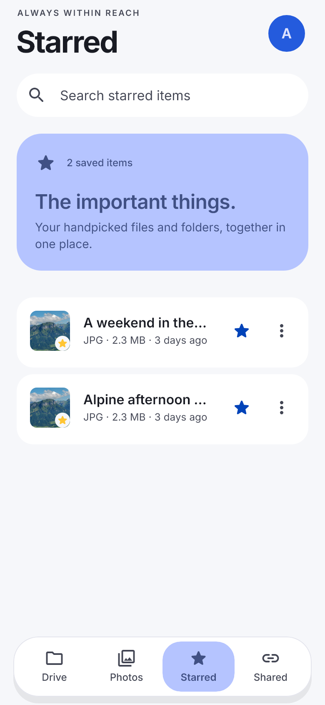</picture></td><td align="center"><picture><source media="(prefers-color-scheme: dark)" srcset="docs/assets/readme/starred-ios-dark.webp">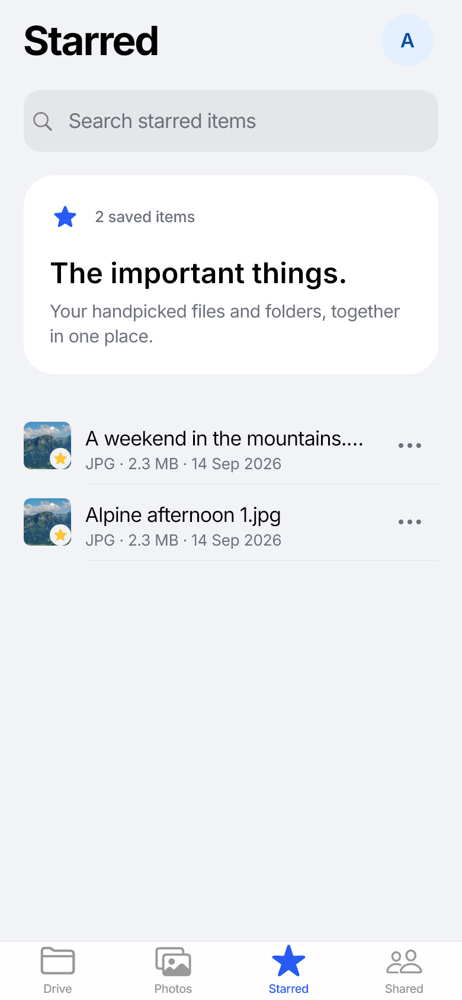</picture></td></tr>
<tr><td>Keep frequently used material easy to find.</td><td>Use the same starring actions through platform-specific controls.</td></tr>
</table>

**Try it:** star a travel folder and a frequently used document. Return to Starred from another tab; unstar an item when it no longer needs a shortcut.

### Shared: a link with a place to manage it

Create a public link from an eligible item, copy it, or pass it to the system share sheet. The Shared tab brings those links back together with their state and available usage information.

<table>
<tr><th align="center" width="50%">Android</th><th align="center" width="50%">iOS</th></tr>
<tr><td align="center"><picture><source media="(prefers-color-scheme: dark)" srcset="docs/assets/readme/shared-android-dark.webp">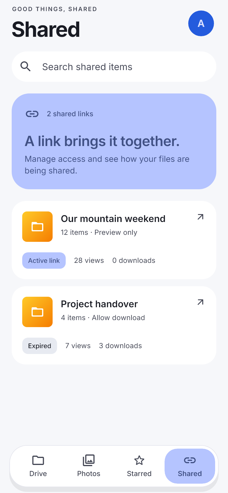</picture></td><td align="center"><picture><source media="(prefers-color-scheme: dark)" srcset="docs/assets/readme/shared-ios-dark.webp">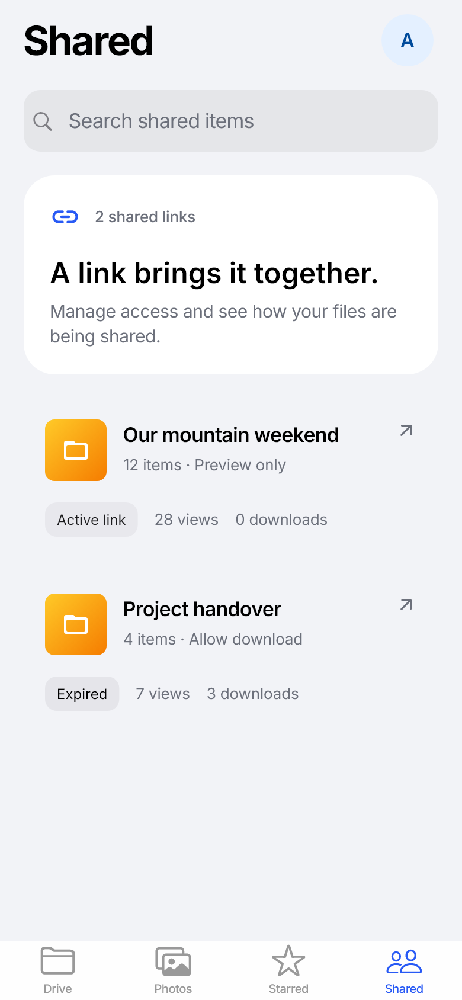</picture></td></tr>
<tr><td>Find shared collections and inspect their current state.</td><td>Open a share for link details, permissions and available activity.</td></tr>
</table>

A share's details show the rules returned by the backend, such as preview/download permission and expiry when present. Available view/download counts and access records come from the service. Revoke a link when it should stop working.

**Try it:** share a project folder, copy the resulting URL, and reopen it from Shared later. Check the permission shown before distributing the link. Anyone holding a public link may be able to access its contents under those rules.

## Add files and follow their progress


Choose files or media through the app's add flow. TeleDrive prepares the upload, sends supported file bytes from the device to Telegram, then records the completed file in the backend.

The upload panel shows real queue states, per-item progress, errors, and available retry or cancel actions. You can minimize the details and keep navigating. If mobile uploads are disabled, items wait for an allowed connection; changing that preference can resume the existing queue without choosing the files again.

**A practical sequence**

1. Connect the active account to Telegram on this device.
2. Open the add flow and choose your files.
3. Follow the queue while you browse other tabs.
4. If an item waits for Wi-Fi, connect to Wi-Fi or allow mobile data.
5. Open the completed item from the library.

**Completion has two steps.** Sending to Telegram and recording the file in the library are separate operations. If the original send succeeds but the metadata commit needs a retry, TeleDrive persists that pending work and retries the commit without uploading the original again. Pending commits block switching or removing that account until they are resolved.

If direct transfer support or local authorization is unavailable, the app fails closed. It does not silently route personal-file upload bytes through a backend fallback.

## Back up your gallery with controls you can find

Photo Backup discovers eligible device media and queues it into **Auto → Media → Photos or Videos**. Device-library permission and a ready Telegram connection are required.

Upload preferences control mobile-data use, large-file confirmation, and duplicate naming. Backup preferences control Wi-Fi behavior, scan limits, queued work, and scan reports.

<table>
<tr><th align="center" width="50%">Upload preferences · iOS</th><th align="center" width="50%">Photo Backup · iOS</th></tr>
<tr><td align="center"><picture><source media="(prefers-color-scheme: dark)" srcset="docs/assets/readme/uploads-ios-dark.webp">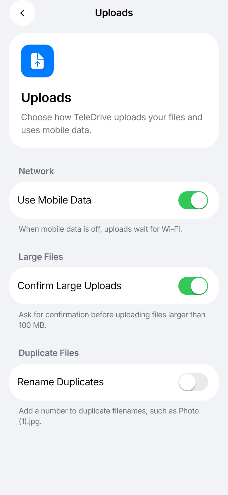</picture></td><td align="center"><picture><source media="(prefers-color-scheme: dark)" srcset="docs/assets/readme/backup-ios-dark.webp">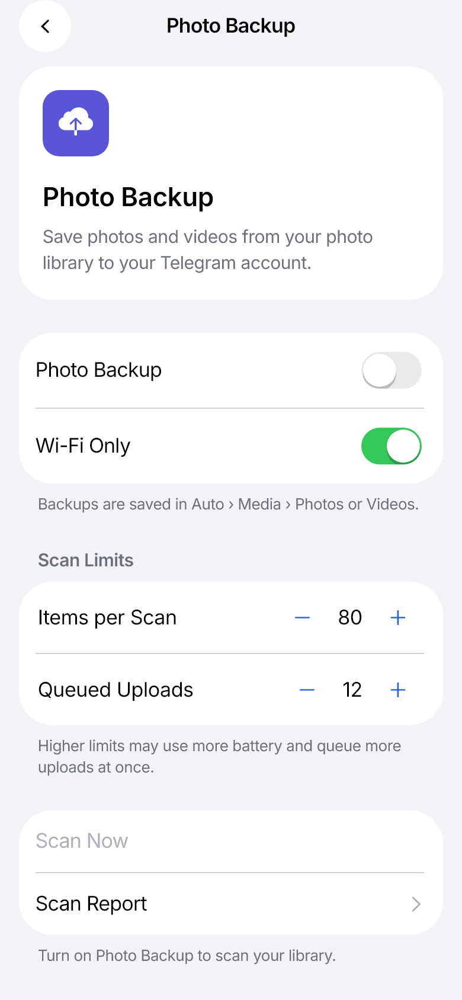</picture></td></tr>
<tr><td>Choose when uploads can use mobile data and how file handling behaves.</td><td>Tune discovery and queue limits; inspect the scan report when an item is skipped.</td></tr>
</table>

On Android, the account sheet exposes the backup on/off control and Settings → Backup adjusts scan behavior. On iOS, Photo Backup is available through the account and settings surfaces.

**Try it:** enable backup, grant the requested library access, keep Wi-Fi-only mode on if that suits your connection, and inspect a scan report before increasing the queue limits. Scan and transfer progress depend on platform permissions, connectivity, and app lifecycle.

### Cache cleanup and Free Up Space are different

- **Cache & Storage** removes local app cache that can be fetched again.
- **Free Up Space** scans for eligible local gallery copies that already have a confirmed backup and presents a removal confirmation.
- Manual uploads, failed backups, unfinished uploads, and items without a matching cloud copy are excluded from that cleanup flow.
- iOS media deletion uses the system confirmation and Recently Deleted behavior.

Review the proposed items before removing local originals. Backup discovery does not mean that every file is already safely uploaded.

## Account, appearance, and everyday preferences

<table>
<tr><th align="center" width="50%">Account · iOS</th><th align="center" width="50%">Settings · iOS</th></tr>
<tr><td align="center"><picture><source media="(prefers-color-scheme: dark)" srcset="docs/assets/readme/account-ios-dark.webp">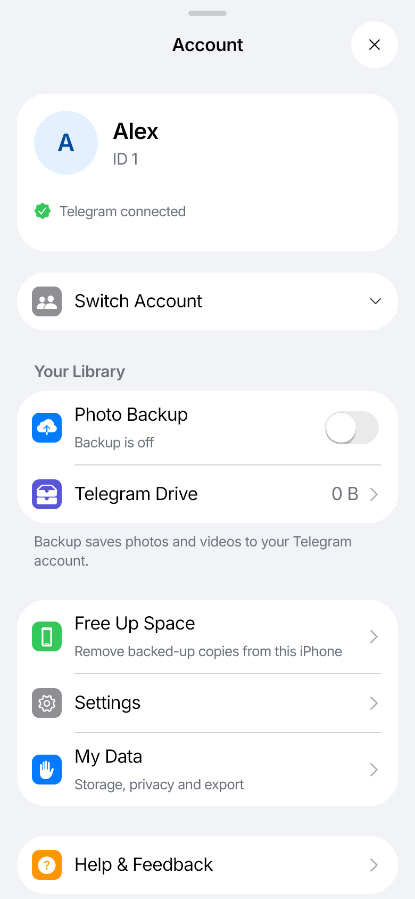</picture></td><td align="center"><picture><source media="(prefers-color-scheme: dark)" srcset="docs/assets/readme/settings-ios-dark.webp">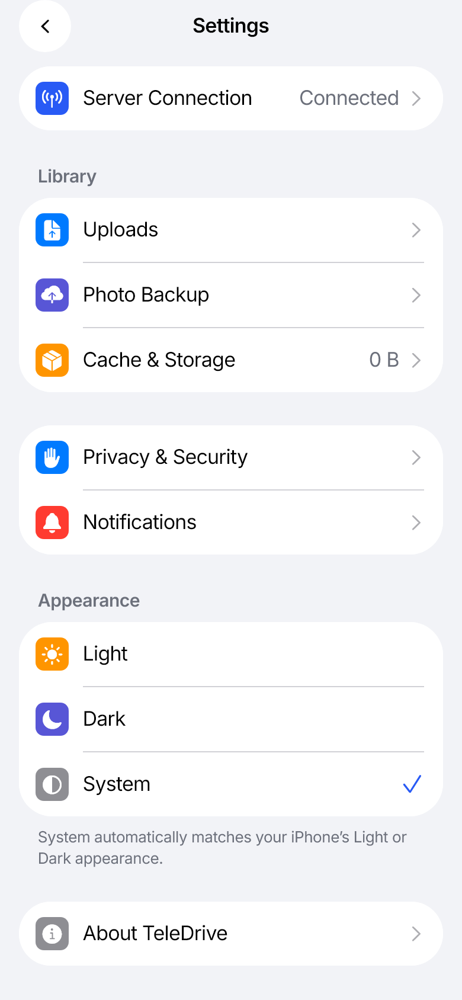</picture></td></tr>
<tr><td>Reach account switching, backup, storage, Free Up Space and My Data.</td><td>Choose light, dark or system appearance and adjust grouped preferences.</td></tr>
</table>

Saved accounts have separate active identities. Backend sessions, local Telegram authorization, media caches, and pending upload records remain scoped to the account and backend they belong to.

Settings also exposes server connection information, privacy controls, notification preferences, and the available app-update controls. My Data groups account/storage information and the supported export and diagnostic tools.

The interface includes large-text layouts, semantic labels, reduced-motion handling, and light/dark themes. Native controls, device fonts, permission dialogs, and platform behavior should still be assessed on the target device.

## Get started

You need a reachable TeleDrive backend and a Telegram account. This checkout is the mobile client; it does not start or deploy the backend.

For downloadable builds, check the **assets and installation notes** on the [GitHub Releases page](https://github.com/ShekhawatPriya/TeleDrive/releases). Some releases contain source only. An iOS development build is not a general-purpose installation package or an App Store listing.

### Development requirements

| Component | Requirement |
| --- | --- |
| Flutter | **3.44.1**, matching the checked-in CI pin |
| Dart | **3.12.x** with the project's `^3.12.0` SDK constraint |
| Android | JDK **17**, Android SDK, Android **12 / API 31** or later |
| Android architectures | Release APK: **arm64-v8a**; debug also includes **x86_64** |
| iOS | macOS, Xcode, signing configuration, CocoaPods where required; deployment target **iOS 15** |
| Backend | A compatible, reachable TeleDrive API |
| Telegram | Your application's API ID and API hash from [my.telegram.org](https://my.telegram.org) |

Newer native iOS controls depend on OS availability and use Flutter fallbacks where the bridge is unavailable.

### Clone and configure

PowerShell, from the directory where you keep your projects:

```powershell
git clone https://github.com/ShekhawatPriya/TeleDrive.git
Set-Location TeleDrive

if (-not (Test-Path .env.local)) {
    Copy-Item .env.example .env.local
}
notepad .env.local
```

Set the backend URL and Telegram API credentials before launching. Use a URL the **phone** can reach; `localhost` on a physical phone is not your development computer.

The tracked template currently points at a hosted HTTPS service with backend pinning enabled. That is a configuration example, not an uptime guarantee. If you use your own backend, set its URL and give its independent database a distinct backend identity.

```powershell
flutter pub get
flutter devices
flutter run -t lib/main.dart
```

If multiple devices are connected, select one explicitly:

```powershell
flutter run -d <device-id> -t lib/main.dart
```

### Sign in and connect the device

<table>
<tr><th align="center" width="50%">Android</th><th align="center" width="50%">iOS</th></tr>
<tr><td align="center"><picture><source media="(prefers-color-scheme: dark)" srcset="docs/assets/readme/login-android-dark.webp">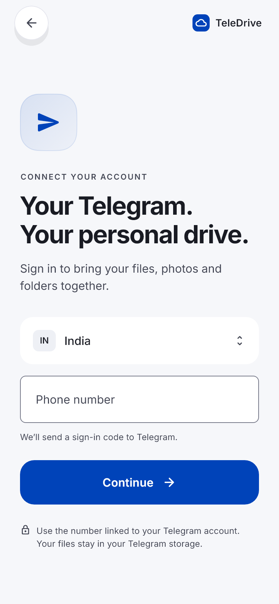</picture></td><td align="center"><picture><source media="(prefers-color-scheme: dark)" srcset="docs/assets/readme/login-ios-dark.webp">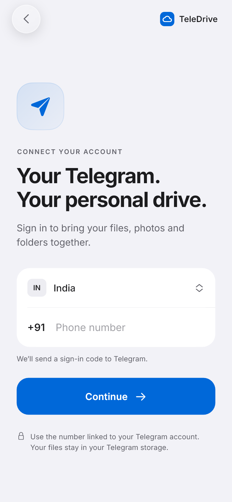</picture></td></tr>
<tr><td>Material phone-number entry and authentication flow.</td><td>Cupertino phone-number entry and authentication flow.</td></tr>
</table>

1. Sign in through the phone/code flow; provide a Telegram password when requested.
2. Complete the device's local Telegram connection if the app asks for it.
3. Complete community onboarding when required by the backend.
4. Open Drive, add a small file, and follow its transfer state.

Backend authentication and local TDLib authorization serve different purposes. A signed-in account can still need its device connection completed before direct transfers are ready.

### Run on an iPhone

On a Mac, create `.env.local` as above and install dependencies. Then prepare the iOS workspace:

```sh
flutter pub get
flutter precache --ios
flutter build ios --config-only -t lib/main.dart
cd ios
pod install
cd ..
open ios/Runner.xcworkspace
```

Choose the signing team for Runner in Xcode, resolve the pinned TDLib package, and pair the device. See the [iOS build guide](docs/ios-build.md) for first-time trust, Developer Mode, signing, and native bridge troubleshooting.

```sh
flutter run -d <iphone-id> -t lib/main.dart
```

Use a release-mode device run when you need the installed app to launch independently after disconnecting from the development tools:

```sh
flutter run --release -d <iphone-id> -t lib/main.dart
```

Windows can edit the shared Dart and iOS source; iOS compilation and signing require macOS/Xcode.

## Configuration

Use [.env.example](.env.example) as the complete template. Keep local configuration in the ignored `.env.local`.

| Setting | Purpose |
| --- | --- |
| `API_BASE_URL` | Backend API address, normally an HTTPS URL ending in `/api` |
| `BACKEND_PINNED` | Keep the app on the configured backend instead of silently falling back to discovery |
| `BACKEND_IDENTITY` | Stable storage identity across a URL migration; change it for a different backend database |
| `TELEGRAM_API_ID`, `TELEGRAM_API_HASH` | Telegram application credentials used by the local TDLib connection |
| `DIRECT_TELEGRAM_UPLOAD_ENABLED`, `DIRECT_TELEGRAM_DOWNLOAD_ENABLED` | Local direct-transfer switches; readiness and backend capability still matter |
| `CLIENT_DERIVATIVE_GENERATION_ENABLED` | Enable supported client-side thumbnails, previews and posters |
| `GALLERY_BACKUP_ENABLED` | Enable the gallery-backup feature; user settings and permissions still apply |
| `MAX_CONCURRENT_TELEGRAM_UPLOADS` | Bound concurrent direct uploads |
| `APP_UPDATE_MANIFEST_URL`, `APP_UPDATE_CHECKS_ENABLED` | Android update-manifest location and update checking |
| `GITHUB_REPO_OWNER`, `GITHUB_REPO_NAME` | Repository used for project information and published release notes |

`.env.local` is bundled in the app. It is **client configuration, not a secret vault**. Leave `GITHUB_TOKEN` empty in publicly distributed builds; do not bundle privileged credentials.

For a deliberate local-backend setup, review [backend resolution and platform compatibility](docs/platform-design-and-vps.md). Do not change a stable backend identity merely because the server URL changed.

## Architecture

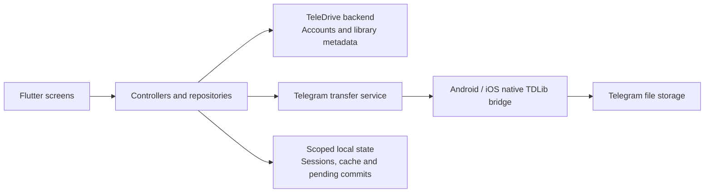

The client owns presentation, device permissions, local caching, and the supported direct-transfer flow. The separate backend supplies account and library APIs. Presentation widgets use shared services rather than invoking TDLib directly.

**The important boundaries**

- **Identity:** the local Telegram user must match the active backend account before direct upload.
- **Completion:** only a final positive Telegram message ID can complete the original upload.
- **Recovery:** persist pending commit state before notifying the backend; retry metadata completion without repeating a successful upload.
- **Derivatives:** a failed thumbnail or poster must not discard a successfully uploaded original.
- **Media:** lazy grids, pagination, bounded concurrency, and account/revision-aware caches limit unnecessary work.
- **Navigation:** persistent tabs retain their state while account flows and detail pages use their own routes.

See the [transfer-service contract](docs/telegram-transfer-service.md) and [media-loading design](docs/media-loading.md) for implementation detail.

### Platform behavior

| Area | Android | iOS |
| --- | --- | --- |
| Interface | Material components | Cupertino layouts and available UIKit bridges |
| Native media access | MediaStore | PhotoKit |
| Direct file transfers | Native TDLib bridge | Native TDLib bridge pinned to the same upstream revision |
| Background behavior | Can continue while the process remains alive | Can suspend with the app and resume on foreground |
| App updates | In-app APK update path when a compatible manifest/build is published | No APK updater; use the applicable Apple distribution/development route |
| Native builds | Android SDK and JDK 17 | macOS, Xcode and signing |

This repository currently targets Android and iOS. A Flutter codebase alone does not imply configured web or desktop builds. Device permissions, Telegram limits, backend policy, available storage, and OS scheduling still affect what the app can do.

## Working on the client

### Source map

| Location | Responsibility |
| --- | --- |
| [lib/main.dart](lib/main.dart) | Configuration and application startup |
| [lib/app.dart](lib/app.dart), [lib/app_router.dart](lib/app_router.dart) | App composition, routing and account redirects |
| [lib/main_shell.dart](lib/main_shell.dart) | Persistent tabs and upload controls |
| [lib/features/](lib/features/) | Drive, Photos, authentication, sharing, profile and settings |
| [lib/core/network/](lib/core/network/) | API client and backend resolution |
| [lib/core/storage/](lib/core/storage/) | Preferences, secure storage and local caches |
| [lib/core/telegram/](lib/core/telegram/) | Shared transfer and local authorization boundary |
| [lib/core/media/](lib/core/media/) | Device media and derivative support |
| [lib/core/theme/](lib/core/theme/) | Semantic palette, type, spacing, shape and motion |
| [lib/widgets/](lib/widgets/) | Shared controls, sheets and native-control fallbacks |
| [android/app/src/main/kotlin/](android/app/src/main/kotlin/) | Kotlin platform bridges |
| [ios/Runner/](ios/Runner/) | Swift platform bridges and iOS resources |
| [test/](test/) | Unit/widget regression suites and fixture content |

The project uses Riverpod providers, ChangeNotifier controllers, and feature repositories. Several larger Dart libraries use `part` files; read the parent library before changing a part.

For a visual change, begin with the existing tokens and platform components. Keep shared business behavior behind shared actions while allowing platform-appropriate layouts and navigation.

### Local development checks

For code changes, the repository's normal developer commands are:

```powershell
flutter analyze --no-pub
flutter test --no-pub
flutter build apk --debug --no-pub
```

These are contributor instructions, not a statement that a particular checkout or release has passed them.

The existing design workflow can export populated fixture screens:

```powershell
flutter test --no-pub test/modernization_ui_test.dart test/navigation_shell_test.dart --dart-define=WRITE_UI_PREVIEWS=true
dart run scripts/build_design_gallery.dart
```

The gallery is written under `build/modernization/`. These are widget fixtures; use production entry point `lib/main.dart` for device runs and the native guides for UIKit/TDLib behavior.

## Troubleshooting

| What you see | Start here |
| --- | --- |
| Backend unavailable | Check the phone-reachable API URL and pinning mode in Server Connection. A pinned backend should not silently change servers. |
| Signed in, but transfers unavailable | Complete local Telegram authorization and confirm that the device account matches the active account. |
| Uploads waiting for Wi-Fi | Connect to Wi-Fi or allow mobile data in upload preferences. Backup has its own Wi-Fi preference. |
| Account switch is blocked | Let the active account resolve its pending upload commits; those records cannot move to another account. |
| A thumbnail is missing | Use the available retry action. Preview availability is distinct from whether the original upload succeeded. |
| iPhone build cannot resolve native dependencies | Open the workspace rather than the project and follow the pinned-package steps in the iOS build guide. |
| No Android update is offered | Check that the selected release actually has a compatible APK and updater manifest, with a higher build number. A source tag alone is not an app update. |

## Developer guides

- [Contributor guide](CONTRIBUTING.md) — project workflow and contribution expectations.
- [Design workflow](docs/design-workflow.md) — hierarchy, fixtures and visual review.
- [iOS design](docs/ios-design.md) — native controls, sheets, previews and selection.
- [Drive home design](docs/drive-home-design.md) — content order, search and keyboard behavior.
- [Platform and backend compatibility](docs/platform-design-and-vps.md) — platform treatment and hosted connection.
- [Modernization rationale](docs/modernization.md) — cross-feature product contracts.
- [iOS build guide](docs/ios-build.md) — signing, native packages and device setup.
- [TDLib artifact provenance](android/app/src/main/jniLibs/README.md) — Android artifacts and upstream revision.
- [Device verification guide](docs/tdlib-real-device-verification.md) — native transfer scenarios and historical records.
- [Security reporting](SECURITY.md) — reporting a vulnerability privately.

## Artwork and licensing

The four paper illustrations were generated with the built-in image-generation tool for this README. Their exact prompts and provenance are recorded in [provenance.json](docs/assets/readme/provenance.json). They are documentation assets and are not bundled into the app.

The product images reuse existing rendered fixtures. [screenshot-sources.json](docs/assets/readme/screenshot-sources.json) maps each export to its source preview. The mountain photograph visible in the app fixtures is **Fronalpstock big** by **Hannes Röst**, via [Wikimedia Commons](https://commons.wikimedia.org/wiki/File:Fronalpstock_big.jpg), licensed under [CC BY-SA 3.0](https://creativecommons.org/licenses/by-sa/3.0/). Its resized/cropped depictions retain that license; see the [fixture attribution](test/fixtures/design/ATTRIBUTION.md).

A repository-wide software license has not been selected. The image attribution above does not grant a license to the application source. Select and add a software license before presenting this repository as open source.

---

<div align="center">

**Your files, with room to find them again.**

[Explore the app](#explore-the-app) · [Get started](#get-started) · [Developer guides](#developer-guides)

</div>
