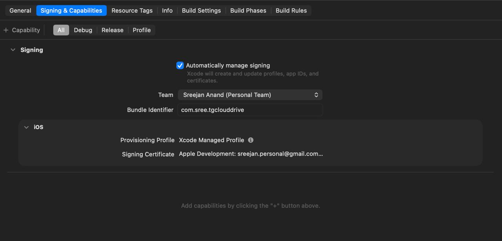

# iOS Build Guide

The iOS port is a 1:1 replica of the Android native layer: a Swift TDLib
bridge behind MethodChannel `teledrive/tdlib` + EventChannel
`teledrive/tdlib/events`, and a PhotoKit media bridge behind
`teledrive/media`. The Dart layer is shared — no platform forks.

All iOS code lives in the repo and is written/maintained on any OS, but
**compiling and running requires a Mac with Xcode**. This guide is the Mac
side of the workflow.

## TDLib binary

- Android ships `libtdjsonjava.so` built from TDLib commit
  `e0943d068ce90b5010f1aea946e6901e25b43bf6`
  (see `android/app/src/main/jniLibs/README.md`).
- iOS uses the prebuilt **TDLibFramework** Swift package from Swiftgram,
  pinned to the release built from the **same commit**:
  [`1.8.64-e0943d06`](https://github.com/Swiftgram/TDLibFramework/releases/tag/1.8.64-e0943d06)
  (`TDLibFramework.zip` sha256
  `0929dbd7d79ca301b60612431aa4e811c946110e4f8439e41ae1b7410436b830`).
  Both platforms therefore speak an identical TDLib JSON API.
- The package reference is already wired into
  `ios/Runner.xcodeproj/project.pbxproj` (exact version). Xcode resolves and
  downloads it automatically on first build (~330 MB; unused slices are
  stripped from the final app).

**Updating TDLib:** always move both platforms together. Rebuild the Android
`.so` at the new commit per the jniLibs README, then change the
TDLibFramework version in Xcode (or in `project.pbxproj`) to the release
tagged with the same commit suffix. After updating, re-test the calls listed
in `docs/tdlib-real-device-verification.md` — field names inside `updateFile`
and friends have shifted between 1.8.x releases.

## Prerequisites

- macOS with **Xcode 16+** (`xcode-select --install` for command-line tools)
- **CocoaPods** (`sudo gem install cocoapods` or via Homebrew) — the project
  uses Swift Package Manager for SPM-ready plugins and CocoaPods for the rest
- **Flutter 3.44.x** on the stable channel (`flutter --version` should match
  the version pinned by CI/the Windows dev machine)
- A `.env.local` at the repo root (same file the Android build uses), since
  it is bundled as a Flutter asset

## First build

```sh
flutter pub get
flutter precache --ios
flutter build ios --config-only   # generates Generated.xcconfig + plugin glue
cd ios && pod install && cd ..
open ios/Runner.xcworkspace        # ALWAYS the .xcworkspace, not .xcodeproj
```

In Xcode, one-time setup:

1. Select the **Runner** target → Signing & Capabilities → choose your
   **Team** (automatic signing). The bundle id is **`com.sree.tgclouddrive`**
   (changed from the generated `com.example.flutterMFsdk`; keep the pbxproj
   committed so it persists). No extra capabilities are needed — local
   notifications, photos, camera, and local network are Info.plist
   permissions, not entitlements. Free Personal Teams work, with the usual
   limits: installs expire after 7 days (re-run to refresh) and no
   TestFlight/App Store distribution.
2. Wait for SPM to finish resolving **TDLibFramework** (status bar). The
   first resolve downloads the zip; subsequent builds use the cache.
3. Pair the iPhone — the first connection must be **wired**, and iOS hides
   the Developer Mode toggle until a Mac attempts developer access:
   connect via USB (data cable), unlock, tap **Trust This Computer**, then
   open Xcode → Window → **Devices and Simulators** and wait for
   "Preparing device for development" to finish. Only then does
   Settings → Privacy & Security → **Developer Mode** appear on the phone
   (bottom of the screen). Enable it, let the phone restart, confirm.
   After the first install, also trust the developer certificate
   (Settings → General → VPN & Device Management). Wireless debugging can
   be enabled afterwards via "Connect via network" in the Devices window.
   (The `pod install` warning about `Pods-Runner.profile.xcconfig` is
   standard Flutter behavior — ignore it.)

Then either run from Xcode or:

```sh
flutter devices
flutter run -d <your-iphone>
```

For an install intended to open from the home screen after disconnecting from
the Mac, use a release build:

```sh
flutter run --release -d <your-iphone>
```

Debug builds require Flutter tooling or Xcode to launch the debug engine on a
physical iPhone. Use release mode when checking standalone startup and relaunch
behavior.

The app builds and runs even if TDLib setup is somehow broken — the Dart
layer treats a missing/failing bridge as "unavailable" and disables
transfers rather than crashing.

## What to verify on device

Run through `docs/tdlib-real-device-verification.md`. iOS-specific additions:

- **Local network prompt** appears on first backend discovery; UDP broadcast
  is expected to fail (Apple gates it behind a special entitlement) and the
  resolver must fall through to the subnet scan ("Found by network scan").
- **Photos permission** prompt appears before gallery backup / free-up-space
  scans (proves the permission strategy compiled in).
- **HEIC/video derivatives** generate with correct orientation.
- **Free up space** shows the system delete confirmation; cancelling it must
  report "Nothing was deleted." Deleted items land in Recently Deleted
  (30-day retention) — that is iOS behavior, not a bug.
- **TDLib version tripwire**: after login, send `getOption("version")` from
  a debug hook or check the Xcode console — expect `1.8.64`.
- **Account switch** mid-session must surface `tdlib_reconfigured` cleanup
  (in-flight transfers cancel) and then re-authorize cleanly.
- **Relaunch** the app — the TDLib session must persist (no re-login).

## Known platform differences (by design)

| Area | Android | iOS |
| --- | --- | --- |
| Backgrounded transfers | Continue while process lives | Suspend with the app; resume on foreground. No `UIBackgroundModes` in v1. |
| Backend discovery | UDP broadcast + subnet scan | Subnet scan only (broadcast needs Apple's multicast entitlement) |
| In-app APK updater | Supported | Hidden — App Store/TestFlight only (Apple rule) |
| Freed-up photos | Deleted immediately | Move to Recently Deleted for 30 days |
| Cleartext HTTP | `usesCleartextTraffic` | ATS exception for **local networking only** (`NSAllowsLocalNetworking`) |

## Troubleshooting

- **SPM cannot resolve TDLibFramework**: File → Packages → Reset Package
  Caches, then resolve again. Check the exact-version pin survived any
  pbxproj merges.
- **Photo permission instantly "permanently denied"**: the permission
  strategy was compiled out. For CocoaPods-mode builds the Podfile
  post_install adds `PERMISSION_PHOTOS=1`; for SPM-mode builds the plugin
  derives it from `NSPhotoLibraryUsageDescription` in Info.plist. Either
  way: `rm -rf ~/Library/Developer/Xcode/DerivedData` and rebuild so the
  package manifest re-evaluates.
- **Channel methods all throw MissingPluginException**: the app launched
  before `didInitializeImplicitFlutterEngine` registered the channels —
  check `ios/Runner/AppDelegate.swift` compiles and is the `@main` class;
  never register channels via `window?.rootViewController` (crashes under
  the UIScene template).
- **Linker errors for `td_*` symbols**: the TDLibFramework product is
  missing from Runner → General → Frameworks; re-add the package product to
  the Runner target.

## Native item-interaction fixture

Use a simulator for this isolated fixture, never a physical device. It uses
fixture models, a local photo and callbacks that do not mutate a live account.
The test runner checks its fixture marker before interacting. Find a booted
simulator UUID with `xcrun simctl list devices` and substitute it below:

```sh
flutter build ios --simulator --debug --no-pub -t tools/ios_item_preview.dart --dart-define="PHOTO_PREVIEW_PATH=$PWD/test/fixtures/design/alpine.jpg" --dart-define="PDF_PREVIEW_PATH=$PWD/test/fixtures/design/menu-preview.pdf"
xcrun simctl install <simulator-uuid> build/ios/iphonesimulator/Runner.app
ruby scripts/test_ios_item_menus.rb <simulator-uuid>
```

The Ruby helper uses CocoaPods' `xcodeproj` gem to generate an isolated XCTest
runner under `build/native-item-tests-*`; its result bundle includes native menu
and selection screenshots. It does not modify the production Xcode project.
The iOS 26.5 simulator checks holding an item, committing its preview, native
menu actions, state refresh, scrolling and selection. Physical iPhone gesture
feel and VoiceOver remain separate checks.

After fixture work, restore the production entry point for device builds:
`flutter build ios --release --no-pub -t lib/main.dart`.
